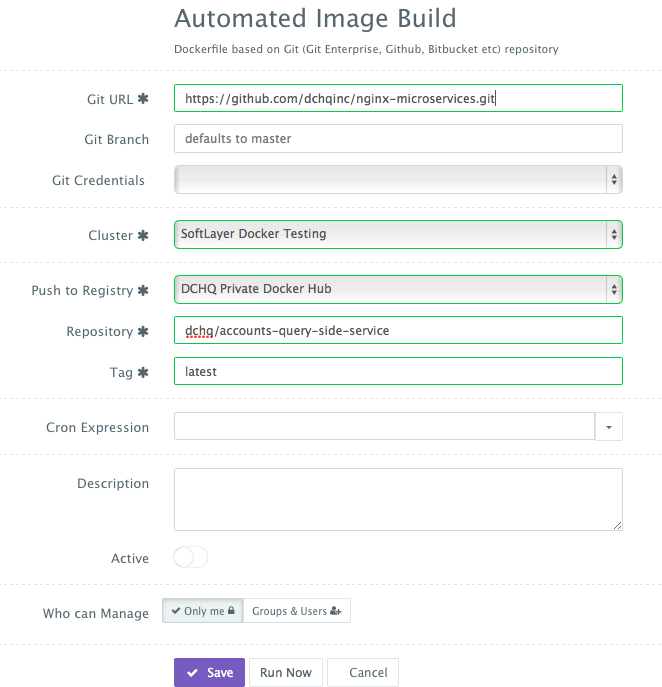

<figure>

</figure>

### **WARNING** -- this project is under progress

This is an extension of this project (https://github.com/cer/event-sourcing-examples). The project now provides a consolidated front-end that uses all of the microservices and can run on any web server. In this project, we use Nginx. The front-end provides the following capabilities:
-   **Create a new account using an initial balance**
-   **Query an account to get the remaining balance**
-   **Transfer money from one account to another**

The purpose of this project is to show how users can automate the deployment & management of this Docker Java Microservices application on any cloud or virtualization platform.

To run & manage the **Event Sourcing Docker Java Microservices** application template in this project on 13 different clouds and virtualization platforms (including vSphere, OpenStack, AWS, Rackspace, Microsoft Azure, Google Compute Engine, DigitalOcean, IBM SoftLayer, etc.), make sure that you either:
-   **Sign Up for FREE on DCHQ.io** -- <http://dchq.io> (no credit card required), or
-   **Download DCHQ On-Premise Standard Edition for FREE** -- <http://dchq.co/dchq-on-premise-download.html>

**Table of Contents**  

- [DCHQ - Event Sourcing Docker Java Microservices ](#dchq---event-sourcing-docker-java-microservices-)
- [A step by step guide for automating the deployment & management of a Docker Java Microservices application on any cloud or virtualization platform](#dchq---event-sourcing-docker-java-microservices-)
	- [Background](#background)
	- [Applying a patch and building the JAR files](#applying-a-patch-and-building-the-jar-files)
	- [Automating the building of Docker images from Dockerfiles in this project using DCHQ](#automating-the-building-of-docker-images-from-dockerfiles-in-this-project-using-dchq)
	- [Building the YAML-based application templates that can re-used on any Linux host running anywhere](#building-the-yaml-based-application-templates-that-can-re-used-on-any-linux-host-running-anywhere)
		- [Plug-ins to configure Web Server at Request Time and Post Provision](#plug-ins-to-configure-web-server-at-request-time--post-provision)
		- [Service Discovery with plug-in life-cycle stages](#service-discovery-with-plug-in-life-cycle-stages)
		- [cluster_size and host Parameters for HA Deployment Across Multiple Hosts](#cluster_size-and-host-parameters-for-ha-deployment-across-multiple-hosts)
		- [Environment Variable Bindings Across Images](#environment-variable-bindings-across-images)
		- [Event Sourcing Docker Java Microservices](#event-sourcing-docker-java-microservices)
	- [Provisioning & Auto-Scaling the Underlying Infrastructure on Any Cloud](#provisioning--auto-scaling-the-underlying-infrastructure-on-any-cloud)
	- [Deploying the Multi-Tier Java Application on the Rackspace Cluster](#deploying-the-multi-tier-java-application-on-the-rackspace-cluster)
	- [Accessing The In-Browser Terminal For The Running Containers](#accessing-the-in-browser-terminal-for-the-running-containers)
	- [Monitoring the CPU, Memory & I/O Utilization of the Running Containers](#monitoring-the-cpu-memory--io-utilization-of-the-running-containers)
	- [Enabling the Continuous Delivery Workflow with Jenkins to Update the JAR File of the Running Application when a Build is Triggered](#enabling-the-continuous-delivery-workflow-with-jenkins-to-update-the-jar-file-of-the-running-application-when-a-build-is-triggered)
	- [Conclusion](#conclusion)
 

DCHQ - Event Sourcing Docker Java Microservices 
===========================
<figure>

</figure>

 

A Step by Step Guide for Deploying & Managing a Docker-based Java Application with Solr on Mongo, Cassandra, MySQL and Oracle
=======================================================================================================================================
 

Background
----------

Containerizing enterprise Java applications is still a challenge mostly because existing application composition frameworks do not address complex dependencies, external integrations or auto-scaling workflows post-provision. Moreover, the ephemeral design of containers meant that developers had to spin up new containers and re-create the complex dependencies & external integrations with every version update.

DCHQ, available in hosted and on-premise versions, addresses all of these challenges and simplifies the containerization of enterprise Java applications through an advance application composition framework that extends Docker Compose with cross-image environment variable bindings, extensible BASH script plug-ins that can be invoked at request time or post-provision, and application clustering for high availability across multiple hosts or regions with support for auto scaling.

Once an application is provisioned, a user can monitor the CPU, Memory, & I/O of the running containers, get notifications & alerts, and get access to application backups, automatic scale in/out workflows, and plug-in execution workflows to update running containers. Moreover, out-of-box workflows that facilitate Continuous Delivery with Jenkins allow developers to refresh the Java WAR file of a running application without disrupting the existing dependencies & integrations.

In previous blogs, we demonstrated the end-to-end deployment automation of more traditional, or typical brownfield Java applications (like Names Directory, Pizza Shop and Movie Store apps) on multi-tier Docker-based application stacks across 13 different clouds & virtualization platforms. For full list of these blogs, you can visit this page: <a href="http://dchq.co/docker-java-applications.html">**http://dchq.co/docker-java-applications.html**</a>

In this project, we focus on a microservices architecture that requires no application servers whatsoever. Each micro-service runs on an extremely lightweight Java container. A consolidated front-end was built to make REST API calls to each of the connected microservices in order execute a specific task (e.g. create an account, query an account or transfer money from one account to another). One of the main advantages of micro-services (when compared to a typical monolithic application) is that these modular services can be easily replaced and extended without requiring changes to the other microservices. In a way, this eliminates single points of failure and makes it easier for developers to contribute to the overall project.

In this project, we will provide a step-by-step guide for deploying and managing this Java application on different cloud/virtual infrastructure.

We will cover:

-   Applying a patch and building the JAR files

-   Automating the building of Docker images from Dockerfiles in this project using DCHQ

-   Building the YAML-based application templates that can re-used on any Linux host running anywhere

-   Provisioning & auto-scaling the underlying infrastructure on any cloud (with Rackspace being the example in this blog)

-   Deploying the multi-tier Java application on the Rackspace cluster

-   Monitoring the CPU, Memory & I/O of the Running Containers

-   Enabling the Continuous Delivery Workflow with Jenkins to update the JAR file of the running microservices when a build is triggered

 

Applying a patch and building the JAR files
---------------------------------------------------------------------------

The JAR files used in the Docker images were built from this project: <a href="https://github.com/cer/event-sourcing-examples">https://github.com/cer/event-sourcing-examples</a>

All of the JAR files were built on December 27th, 2015 and embedded in the Docker images <a href="#automating-the-building-of-docker-images-from-dockerfiles-in-this-project-using-dchq">here</a>.

Before building the JAR files, please copy CORSFilter.java in the "event-sourcing-examples/java-spring/common-web/src/main/java/net/chrisrichardson/eventstore/javaexamples/banking/web/util" directory. You can then execute ./gradlew assemble.

~~~~~~~~~~~~~~~~~~~~~~~~~~~~~~~~~~~~~~~~~~~~~~~~~~~~~~~~~~~~~~~~~~~~~~~~~~~~~~~~
git clone https://github.com/cer/event-sourcing-examples.git
wget https://github.com/dchqinc/event-sourcing-microservices/patch/CORSFilter.java -O /event-sourcing-examples/java-spring/common-web/src/main/java/net/chrisrichardson/eventstore/javaexamples/banking/web/util/CORSFilter.java
cd /event-sourcing-examples/java-spring
./gradlew assemble
~~~~~~~~~~~~~~~~~~~~~~~~~~~~~~~~~~~~~~~~~~~~~~~~~~~~~~~~~~~~~~~~~~~~~~~~~~~~~~~~

 

Automating the building of Docker images from Dockerfiles in this project using DCHQ
---------------------------------------------------------------------------

All of the images in this project have already been built and pushed to the DCHQ public Docker Hub repository. Here are the custom images that will be used in the application template:

-   **dchq/nginx-microservices:latest**
-   **dchq/accounts-command-side-service**
-   **dchq/transactions-command-side-service**
-   **dchq/transactions-command-side-service**-   

To build the images and push them into your own Docker Hub or Quay repository, you can use DCHQ. Here are the four GitHub projects used for these images:

-   <a href="https://github.com/dchqinc/accounts-command-side-service">https://github.com/dchqinc/accounts-command-side-service</a>
-   <a href="https://github.com/dchqinc/accounts-query-side-service">https://github.com/dchqinc/accounts-query-side-service</a>
-   <a href="https://github.com/dchqinc/transactions-command-side-service">https://github.com/dchqinc/transactions-command-side-service</a>
-   <a href="https://github.com/dchqinc/nginx-microservices">https://github.com/dchqinc/nginx-microservices</a>  

Once logged in to DCHQ (either the hosted DCHQ.io or on-premise version), a user can navigate to **Automate** > **Image Build** and then click on the **+** button to create a new **Dockerfile (Git/GitHub/BitBucket)** image build.

Provide the required values as follows:

-   **Git URL** – (e.g. https://github.com/dchqinc/nginx-microservices.git)

-   **Git Branch** – this field is optional -- but a user can specify a branch from a GitHub project. The default branch is master.

-   **Git Credentials** – a user can store the credentials to a private GitHub repository securely in DCHQ. This can be done by navigating to **Manage** > **Cloud Providers and Repos** and clicking on the **+** to select **Credentials**

-   **Cluster** – the building of Docker images is orchestrated through the DCHQ agent. As a result, a user needs to select a cluster on which an agent will be used to execute the building of Docker images. If a cluster has not been created yet, please refer to this <a href=#provisioning--auto-scaling-the-underlying-infrastructure-on-any-cloud>section</a> to either register already running hosts or automate the provisioning of new virtual infrastructure.

-   **Push to Registry** – a user can push the newly created image on either a public or private repository on Docker Hub or Quay. To register a Docker Hub or Quay account, a user should navigate to **Manage** > **Cloud Providers and Repos** and clicking on the **+** to select **Docker Registries**

-   **Repository** – this is the name of the repository on which the image will be pushed. For example, our image was pushed to **dchq/php-example:latest**

-   **Tag** – this is the tag name that you would like to give for the new image. The supported tag names in DCHQ include:
	
	- **{{date}}** -- formatted date
	
	- **{{timestamp}}** -- the full time-stamp

-   **Cron Expression** – a user can schedule the building of Docker images using out-of-box cron expressions. This facilitates daily and nightly builds for users.

Once the required fields are completed, a user can click **Save**.

A user can then click on the **Play Button** to build the Docker image on-demand.

<figure>

</figure>

 

Building the YAML-based application templates that can re-used on any Linux host running anywhere
-------------------------------------------------------------------------------------------------

Once logged in to DCHQ (either the hosted DCHQ.io or on-premise version), a user can navigate to **Manage** > **App/Machine** and then click on the **+** button to create a new **Docker Compose** template.

We have created an application template using the Docker images we built in the previous step. The template includes the following components:
-   **Nginx** -- for hosting the consolidated front-end for this microservices application
-   **Account Creation, Account Query and Balance Transfer Microservices** -- these services were built from the original project: <a href="https://github.com/cer/event-sourcing-examples">https://github.com/cer/event-sourcing-examples</a>. A patch was applied by copying CORSFilter.java in the "event-sourcing-examples/java-spring/common-web/src/main/java/net/chrisrichardson/eventstore/javaexamples/banking/web/util" directory.
-   **Mongo** -- for the databases

### Plug-ins to Configure Web Server at **Request Time & Post-Provision**

In the application template, you will notice that some of the Nginx container is invoking a BASH script plug-in at request time in order to configure the container. This plug-in can be executed post-provision as well.

These plug-ins can be created by navigating to **Manage > Plug-ins**. Once the BASH script is provided, the DCHQ agent will execute this script **inside the container**. A user can specify arguments that can be overridden at request time and post-provision. Anything preceded by the **$** sign is considered an argument -- for example, **$file_url** can be an argument that allows developers to specify the download URL for a WAR file. This can be overridden at request time and post-provision when a user wants to refresh the Java WAR file on a running container.

The plug-in ID needs to be provided when defining the YAML-based application template. For example, to invoke a BASH script plug-in for Nginx, we would reference the plug-in ID as follows:
~~~~~~~~~~~~~~~~~~~~~~~~~~~~~~~~~~~~~~~~~~~~~~~~~~~~~~~~~~~~~~~~~~~~~~~~~~~~~~~~
nginx:
  image: dchq/nginx-microservices:latest
  publish_all: true
  mem_min: 50m
  host: host1
  plugins:
    - !plugin
      id: Gl5Hi
      restart: true
      lifecycle: on_create
      arguments:
        - ACCOUNT_CMD_IP={{accountscommandside | ip}}
        - ACCOUNT_CMD_PORT={{accountscommandside | port_8080}}
        - ACCOUNT_TRANSFER_IP={{transactionscommandside | ip}}
        - ACCOUNT_TRANSFER_PORT={{transactionscommandside | port_8080}}
        - ACCOUNT_QUERY_IP={{accountsqueryside | ip}}
        - ACCOUNT_QUERY_PORT={{accountsqueryside | port_8080}}
~~~~~~~~~~~~~~~~~~~~~~~~~~~~~~~~~~~~~~~~~~~~~~~~~~~~~~~~~~~~~~~~~~~~~~~~~~~~~~~~

In this example, **Nginx** is invoking a BASH script plug-in that injects the microservices containers IP’s and port numbers in the **/usr/share/nginx/html/js/app.js** file dynamically (or at request time). The plug-in ID is **Gl5Hi**.

### **Service Discovery** with plug-in life-cycle stages

The **lifecycle** parameter in plug-ins allows you to specify the exact stage or event to execute the plug-in. If not lifecycle is specified, then by default, the plug-in will be execute **on_create**. Here are the supported lifecycle stages:

-   **on_create** -- executes the plug-in when creating the container
-   **on_start** -- executes the plug-in after a container starts
-   **on_stop** -- executes the plug-in before a container stops
-   **on_destroy** -- executes the plug-in before destroying a container
-   **post_create** -- executes the plug-in after the container is created and running
-   **post_start[:Node]** -- executes the plug-in after another container starts
-   **post_stop[:Node]** -- executes the plug-in after another container stops
-   **post_destroy[:Node]** -- executes the plug-in after another container is destroyed
-   **post_scale_out[:Node]** -- executes the plug-in after another cluster of containers is scaled out
-   **post_scale_in[:Node]** -- executes the plug-in after another cluster of containers is scaled in

To get access to the Nginx and Apache HTTP Server (httpd) plug-ins under the EULA license, make sure you either:
-   **Sign Up for FREE on DCHQ.io** -- <http://dchq.io> (no credit card required)
-   **Download DCHQ On-Premise Standard Edition for FREE** -- <http://dchq.co/dchq-on-premise-download.html>

### **cluster_size** and **host** parameters for HA deployment across multiple hosts

You will notice that the **cluster_size** parameter allows you to specify the number of containers to launch (with the same application dependencies).

The **host** parameter allows you to specify the host you would like to use for container deployments. This is possible if you have selected **Weave** as the networking layer when creating your clusters. That way you can ensure high-availability for your application server clusters across different hosts (or regions) and you can comply with affinity rules to ensure that the database runs on a separate host for example. Here are the values supported for the host parameter:

-   *host1, host2, host3*, etc. – selects a host randomly within a data-center (or cluster) for container deployments

-   *IP Address 1, IP Address 2, etc.* -- allows a user to specify the actual IP addresses to use for container deployments

-   *Hostname 1, Hostname 2, etc.* -- allows a user to specify the actual hostnames to use for container deployments

-   *Wildcards* (e.g. “db-*”, or “app-srv-*”) – to specify the wildcards to use within a hostname

### Environment Variable Bindings Across Images

Additionally, a user can create cross-image environment variable bindings by making a reference to another image’s environment variable. In this case, we have made several bindings – including ACCOUNT_CMD_IP={{accountscommandside | ip}} – in which the Account Creation microservice container IP is resolved dynamically at request time and is used to ensure that Nginx can establish a connection with this microservice.

Here is a list of supported environment variable values:

-   **{{alphanumeric | 8}}** – creates a random 8-character alphanumeric string. This is most useful for creating random passwords.

-   **{{Image Name | ip}}** – allows you to enter the host IP address of a container as a value for an environment variable. This is most useful for allowing the middleware tier to establish a connection with the database.

-   **{{Image Name | container_ip}}** – allows you to enter the name of a container as a value for an environment variable. This is most useful for allowing the middleware tier to establish a secure connection with the database (without exposing the database port).

-   **{{Image Name | container_private_ip}}** – allows you to enter the internal IP of a container as a value for an environment variable. This is most useful for allowing the middleware tier to establish a secure connection with the database (without exposing the database port).

-   **{{Image Name | port_Port Number}}** – allows you to enter the Port number of a container as a value for an environment variable. This is most useful for allowing the middleware tier to establish a connection with the database. In this case, the port number specified needs to be the internal port number – i.e. not the external port that is allocated to the container. For example, {{PostgreSQL | port_5432}} will be translated to the actual external port that will allow the middleware tier to establish a connection with the database.

-   **{{Image Name | Environment Variable Name}}** – allows you to enter the value an image’s environment variable into another image’s environment variable. The use cases here are endless – as most multi-tier applications will have cross-image dependencies.

 

### Event Sourcing Docker Java Microservices

~~~~~~~~~~~~~~~~~~~~~~~~~~~~~~~~~~~~~~~~~~~~~~~~~~~~~~~~~~~~~~~~~~~~~~~~~~~~~~~~
nginx:
  image: dchq/nginx-microservices:latest
  publish_all: true
  mem_min: 50m
  host: host1
  plugins:
    - !plugin
      id: Gl5Hi
      restart: true
      lifecycle: on_create
      arguments:
        - ACCOUNT_CMD_IP={{accountscommandside | ip}}
        - ACCOUNT_CMD_PORT={{accountscommandside | port_8080}}
        - ACCOUNT_TRANSFER_IP={{transactionscommandside | ip}}
        - ACCOUNT_TRANSFER_PORT={{transactionscommandside | port_8080}}
        - ACCOUNT_QUERY_IP={{accountsqueryside | ip}}
        - ACCOUNT_QUERY_PORT={{accountsqueryside | port_8080}}
    
accountscommandside:
  image: dchq/accounts-command-side-service
  mem_min: 300m
  cluster_size: 1
  host: host1
  publish_all: true
  environment:
    - EVENTUATE_API_KEY_ID=4K36NGM2J3JAICADIBNK7ZZBR
    - EVENTUATE_API_KEY_SECRET=Fp2xWBexgxLHlB1LwzoKY6RHlHzcllRNgXn+x8i9KvQ

transactionscommandside:
  image: dchq/transactions-command-side-service
  mem_min: 300m
  cluster_size: 1
  host: host1
  publish_all: true
  environment:
    - EVENTUATE_API_KEY_ID=4K36NGM2J3JAICADIBNK7ZZBR
    - EVENTUATE_API_KEY_SECRET=Fp2xWBexgxLHlB1LwzoKY6RHlHzcllRNgXn+x8i9KvQ
    
accountsqueryside:
  image: dchq/accounts-query-side-service
  mem_min: 300m
  cluster_size: 1
  host: host1
  publish_all: true
  environment:
    - EVENTUATE_API_KEY_ID=4K36NGM2J3JAICADIBNK7ZZBR
    - EVENTUATE_API_KEY_SECRET=Fp2xWBexgxLHlB1LwzoKY6RHlHzcllRNgXn+x8i9KvQ
    - SPRING_DATA_MONGODB_URI=mongodb://{{mongodb | container_private_ip}}/mydb

mongodb:
  image: mongo:3.0.4
  host: host1
~~~~~~~~~~~~~~~~~~~~~~~~~~~~~~~~~~~~~~~~~~~~~~~~~~~~~~~~~~~~~~~~~~~~~~~~~~~~~~~~

 

Provisioning & Auto-Scaling the Underlying Infrastructure on Any Cloud
----------------------------------------------------------------------

Once an application is saved, a user can register a Cloud Provider to automate the provisioning and auto-scaling of clusters on 12 different cloud end-points including VMware vSphere, OpenStack, CloudStack, Amazon Web Services, Rackspace, Microsoft Azure, DigitalOcean, IBM SoftLayer, Google Compute Engine, and many others.

First, a user can register a Cloud Provider for Rackspace (for example) by navigating to **Manage** > **Cloud Providers & Repos** and then clicking on the **+** button to select **Rackspace**. The Rackspace API Key needs to be provided – which can be retrieved from the Account Settings section of the Rackspace Cloud Control Panel.

<figure>

</figure>

A user can then create a cluster with an auto-scale policy to automatically spin up new Cloud Servers. This can be done by navigating to **Manage** > **Clusters** page and then clicking on the **+** button. You can select a capacity-based placement policy and then **Weave** as the networking layer in order to facilitate secure, password-protected cross-container communication across multiple hosts within a cluster. The **Auto-Scale Policy** for example, may set the maximum number of VM’s (or Cloud Servers) to 10.

<figure>

</figure>

A user can now provision a number of Cloud Servers on the newly created cluster either through the UI-based workflow or by defining a simple YAML-based Machine Compose template that can be requested from the Self-Service Library.

**UI-based Workflow** – A user can request Rackspace Cloud Servers by navigating to **Manage** > **Hosts** and then clicking on the **+** button to select **Rackspace**. Once the Cloud Provider is selected, a user can select the region, size and image needed. Ports are opened by default on Rackspace Cloud Servers to accommodate some of the port requirements (e.g. 32000-59000 for Docker, 6783 for Weave, and 5672 for RabbitMQ). A Cluster is then selected and the number of Cloud Servers can be specified.

<figure>

</figure>

**YAML-based Machine Compose Template** – A user can first create a Machine Compose template for Rackspace by navigating to **Manage** > **Templates** and then selecting **Machine Compose**.

Here’s the template for requesting a 4GB Cloud Server.

~~~~~~~~~~~~~~~~~~~~~~~~~~~~~~~~~~~~~~~~~~~~~~~~~~~~~~~~~~~~~~~~~~~~~~~~~~~~~~~~
Medium:
  region: IAD
  description: Rackspace small instance
  instanceType: general1-4
  image: IAD/5ed162cc-b4eb-4371-b24a-a0ae73376c73
  count: 1
~~~~~~~~~~~~~~~~~~~~~~~~~~~~~~~~~~~~~~~~~~~~~~~~~~~~~~~~~~~~~~~~~~~~~~~~~~~~~~~~

<figure>

</figure>

The supported parameters for the Machine Compose template are summarized below:

-   **description**: Description of the blueprint/template

-   **instanceType**: Cloud provider specific value (e.g. general1-4)

-   **region**: Cloud provider specific value (e.g. IAD)

-   **image**: Mandatory - fully qualified image ID/name (e.g. IAD/5ed162cc-b4eb-4371-b24a-a0ae73376c73 or vSphere VM Template name)

-   **username**: Optional - only for vSphere VM Template username

-   **password**: Optional - only for vSphere VM Template encrypted password. You can encrypt the password using the endpoint <https://www.dchq.io/#/encrypt>

-   **network**: Optional – Cloud provider specific value (e.g. default)

-   **securityGroup**: Cloud provider specific value (e.g. dchq-security-group)

-   **keyPair**: Cloud provider specific value (e.g. private key)

-   **openPorts**: Optional - comma separated port values

-   **count**: Total no of VM's, defaults to 1.

Once the Machine Compose template is saved, a user can request this machine from the Self-Service **Library**. A user can click **Customize** and then select the **Cloud Provider** and **Cluster** to use for provisioning these Rackspace Cloud Servers.

 

Deploying the Multi-Tier Java Application on the Rackspace Cluster
------------------------------------------------------------------

Once the Cloud Servers are provisioned, a user can deploy a multi-tier, Docker-based Java applications on the new Cloud Servers. This can be done by navigating to the Self-Service Library and then clicking on Customize to request a multi-tier application.

A user can select an Environment Tag (like DEV or QE) and the Rackspace Cluster created before clicking on Run.

<figure>

</figure>

Accessing The In-Browser Terminal For The Running Containers
------------------------------------------------------------

A command prompt icon should be available next to the containers’ names on the Live Apps page. This allows users to enter the container using a secure communication protocol through the agent message queue. A white list of commands can be defined by the Tenant Admin to ensure that users do not make any harmful changes on the running containers.

For the Tomcat deployment for example, we used the command prompt to make sure that the Java WAR file was deployed under the /usr/local/tomcat/webapps/ directory.

<figure>

</figure>

<figure>

</figure>

Monitoring the CPU, Memory & I/O Utilization of the Running Containers
----------------------------------------------------------------------

Once the application is up and running, our developers monitor the CPU, Memory, & I/O of the running containers to get alerts when these metrics exceed a pre-defined threshold. This is especially useful when our developers are performing functional & load testing.

A user can perform historical monitoring analysis and correlate issues to container updates or build deployments. This can be done by clicking on **Stats**. A custom date range can be selected to view CPU, Memory and I/O historically.

<figure>

</figure>

Enabling the Continuous Delivery Workflow with Jenkins to Update the JAR File of the Running Application when a Build is Triggered
----------------------------------------------------------------------------------------------------------------------------------

For developers wishing to follow the “immutable” containers model by rebuilding Docker images containing the application code and spinning up new containers with every application update, DCHQ provides an automated build feature that allows developers to automatically create Docker images from Dockerfiles or private GitHub projects containing Dockerfiles.

However, many developers may wish to *update the running application server containers with the latest Java JAR file* instead. For that, DCHQ allows developers to enable a continuous delivery workflow with Jenkins. This can be done by clicking on the **Actions** menu of the running application and then selecting **Continuous Delivery**. A user can select a Jenkins instance that has already been registered with DCHQ, the actual Job on Jenkins that will produce the latest JAR file, and then a BASH script plug-in to grab this build and deploy it on a running application server. Once this policy is saved, DCHQ will grab the latest WAR file from Jenkins any time a build is triggered and deploy it on the running application server.

Developers, as a result will always have the latest Java JAR file deployed on their running containers in DEV/TEST environments.

<figure>

</figure>

<figure>

</figure>

 

Conclusion
----------

Containerizing enterprise Java applications is still a challenge mostly because existing application composition frameworks do not address complex dependencies, external integrations or auto-scaling workflows post-provision. Moreover, the ephemeral design of containers meant that developers had to spin up new containers and re-create the complex dependencies & external integrations with every version update.

DCHQ, available in hosted and on-premise versions, addresses all of these challenges and simplifies the containerization of enterprise Java applications through an advance application composition framework that facilitates cross-image environment variable bindings, extensible BASH script plug-ins that can be invoked at request time or post-provision, and application clustering for high availability across multiple hosts or regions with support for auto scaling.

Sign Up for FREE on <http://DCHQ.io> or download [DCHQ On-Premise](<http://dchq.co/dchq-on-premise.html>) to get access to out-of-box multi-tier Java application templates along with application lifecycle management functionality like monitoring, container updates, scale in/out and continuous delivery.

